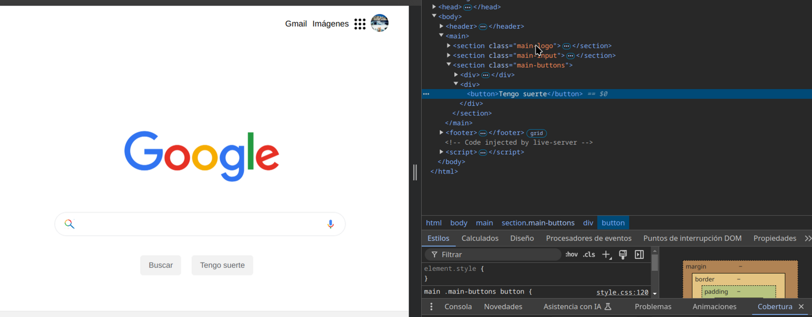
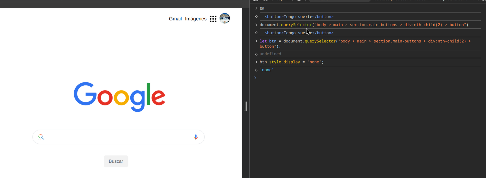

# Concepto

Debugging: proceso de encontrar y resolver defectos o problemas dentro de un programa que impide el funcionamiento correcto del programa.

## Generar sombras

1. agregar estilo box-shadow: 0 0 black
2. click en los dos cuadraditos (open shadow editor)

## Animaciones

daneden.github.io/animate.css/

Tres puntitos - más herramientas - animaciones

## Cómo optimizar código que no uso y está ocupando almacenamiento

Tres puntitos - más herramientas - cobertura

En rojo sale el código que existe pero que no estoy utilizando.

## JavaScript y el DOM

En DevTools, al seleccionar una etiquieta, si luego me voy a la pestaña de consola y escribo `$0` enter, lleva ese elemento seleccionado a JS:

- click derecho - copy JS path - pegar
- puedo modificar el DOM desde la terminal

## Pestaña Rendimiento (Performance)

Se puede modificar la velocidad y conexión a internet, y la velocidad de carga del ordenador.

Tres puntitos - más herramientas - sensores
se puede configurar que en una posición determinada del teléfono, se hagan ciertas cosas.

En un proyecto que haya animaciones (https://googlechrome.github.io/devtools-samples/jank/) podemos modificar la realentización en la pestaña CPU - grabar 4 segundos - analizar la grabación y modificar.

## Eventos

- Fuentes (Sources) - Puntos de interrupción del procesador de eventos (event listener breakpoints) - seleccionar el evento que quieres escuchar (mouse - click) - te lleva al código JS y hace un debugger en la función manejadora - flechita abajo con puntito (para ir al siguiente paso).

Puedo saber el tipo de dato que está cogiendo una función.
En la pestañita de Watch (dentro de sources, cuando estoy haciendo debugger) - escribo `typeof sum` (sum = nombre de mi función) - enter

## Network (red)

Descargas que hace el navegador.

Settings, activar:

- filas de solicitudes grandes (use large request rows)
- vista general (show overview)
- capturas de pantalla (capture screenshots)

En nombre, click derecho, activar cascada (waterfall) y dominio (domain)

En el botón de recargar, si lo dejo pulsado puedo:

- volver a cargar de forma normal
- volver a cargar de manera forzada
- vaciar el caché y volver a cargar de manera forzada

`Ctrl - shift - p `--> sale un buscado de comandos. - click en "mostrar bloqueo de solicitud de red" (show request blocking) - + - escribir el nombre del archivo que quieres bloquear (main.css) - recargar página vaciando el caché - se mostrará la web sin los estilos.

## Lighthouse o Audits

elegir movil y ordenador y dar a auditoría y ver qué puntos se pueden mejorar.
