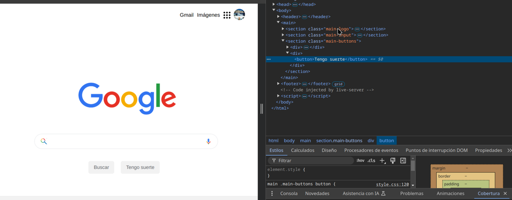
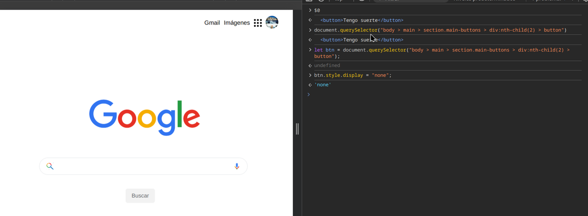

## Concepto

Debugging: proceso de encontrar y resolver defectos o problemas dentro de un programa que impide el funcionamiento correcto del programa.

## Generar sombras

1. agregar estilo box-shadow: 0 0 black
2. click en los dos cuadraditos (open shadow editor)

## Animaciones

daneden.github.io/animate.css/

Tres puntitos - más herramientas - animaciones

## Cómo optimizar código que no uso y está ocupando almacenamiento

Tres puntitos - más herramientas - cobertura

En rojo sale el código que existe pero que no estoy utilizando.

## JavaScript y el DOM

En DevTools, al seleccionar una etiquieta, si luego me voy a la pestaña de consola y escribo `$0` enter, lleva ese elemento seleccionado a JS:

- click derecho - copy JS path - pegar
- puedo modificar el DOM desde la terminal

## Pestaña Rendimiento (Performance)

Se puede modificar la velocidad y conexión a internet, y la velocidad de carga del ordenador.

Tres puntitos - más herramientas - sensores
se puede configurar que en una posición determinada del teléfono, se hagan ciertas cosas.

En un proyecto que haya animaciones (https://googlechrome.github.io/devtools-samples/jank/) podemos modificar la realentización en la pestaña CPU - grabar 4 segundos - analizar la grabación y modificar.

## Eventos

- Fuentes (Sources) - Puntos de interrupción del procesador de eventos (event listener breakpoints) - seleccionar el evento que quieres escuchar (mouse - click) - te lleva al código JS y hace un debugger en la función manejadora - flechita abajo con puntito (para ir al siguiente paso).

Puedo saber el tipo de dato que está cogiendo una función.
En la pestañita de Watch (dentro de sources, cuando estoy haciendo debugger) - escribo `typeof sum` (sum = nombre de mi función) - enter

## Network (red)

Descargas que hace el navegador.

Settings, activar:

- filas de solicitudes grandes (use large request rows)
- vista general (show overview)
- capturas de pantalla (capture screenshots)

En nombre, click derecho, activar cascada (waterfall) y dominio (domain)

En el botón de recargar, si lo dejo pulsado puedo:

- volver a cargar de forma normal
- volver a cargar de manera forzada
- vaciar el caché y volver a cargar de manera forzada

`Ctrl - shift - p `--> sale un buscado de comandos. - click en "mostrar bloqueo de solicitud de red" (show request blocking) - + - escribir el nombre del archivo que quieres bloquear (main.css) - recargar página vaciando el caché - se mostrará la web sin los estilos.

## Lighthouse o Audits

elegir movil y ordenador y dar a auditoría y ver qué puntos se pueden mejorar.

## Cómo hacer aplicaciones web progresivas

https://developers.google.com/codelabs/pwa-training/pwa03--going-offline?hl=es#0

## Examen

1. ¿Cómo podría visualizar la paleta de colores que mi proyecto está utilizando?

- Desde la sección de estilos, al tener un elemento que tenga aplicado algún color, dándole clic al cuadro de color que aparece ahí, tendremos la opción de Page colors que hace referencia a la paleta de colores del proyecto.

2. ¿Donde puedo ver si mis elementos de HTML tienen algún estado de CSS?

- Seleccionando ese elemento y viendo sus estilos.

3. ¿De qué forma puedo buscar palabras específicas en mi documento html, desde el inspector de elementos?

- Presionando “comand/ctrl + F” desde la casilla de Elements

4. ¿Qué tipo de interacción podemos tener en la sección de Elements?

- Manipulación de nuestro HTML.

5. ¿Cuáles son los navegadores que tienen herramientas para desarrolladores?

- Todos los navegadores tienen herramientas para desarrolladores.

6. ¿Cuál es la forma más rápida de generar sombras a mis elementos de html?

- Desde la sección de estilos, al momento de estar modificando los estilos de algún elemento, tendremos un icono de 3 puntos que hace referencia a un menú, ahí encontraremos la opción para poder agregar sombras a elementos y texto.

7. Si yo NO tengo la sección de Animación en mi DevTools, ¿Cómo puedo visualizarla?

- En la parte de menú de tu devtools, tengo que ir a más herramientas “More Tools”, y ahí buscar por Animaciones.

8. ¿Cuál es la sección en la que puedo tener visibilidad del todo el código que no estoy utilizando en un proyecto?

- Desde la sección de “Coverage” yo puedo tener visibilidad del código que está en mi proyecto, pero no es necesario porque no lo utilizo.

9. ¿Para qué puedo utilizar el $0 en la consola de DevTools?

- Me sirve para ver cual es el elemento de HTML que estoy seleccionando.

10. ¿Qué es el JS Path que obtenemos de cada elementos de HTML?

- Es la selección que hacemos a un nodo o elemento del DOM específico con JS

11. ¿Cómo podría cargar mi proyecto desde local, para comenzar a guardar los cambios desde DevTools?

NO --> Desde source, verás que ya hay algunos archivos, esos son tus archivos locales, y todos los cambios se guardan de forma automática

- ¿? Directamente desde la sección de sources seleccionamos “Filesystem” y “agregar un folder a mi espacio de trabajo”

12. ¿Si en mi proyecto estoy utilizando un preprocesador de css como “Stylus”, y utilizo DevTools como IDE, puedo seguir trabajando desde ahí con Stylus?

No --> No, de momento Chrome DevTools, solo entiende Sass.

- ¿? Claro, DevTools, te dejará trabajar con todos los preprocesadores de CSS.

13. ¿Cuáles son las estrategias que existen para poder trabajar proyectos responsive?

- Por viewport de dispositivo, o por diseño.

14. Si tengo un error en mi código que se dispara al momento de mandar llamar una función que está ligada a un botón, ¿cómo podría llegar a esa función para comenzar a debuggear el código?

- Tendríamos que comenzar con el evento de click en ese botón.

15. ¿Para qué utilizamos “Network” en DevTools?

- Esto nos sirve para poder ver ¿qué archivos y assets se están descargando, el estatus, el peso y tiempo de descarga de los mismos?
